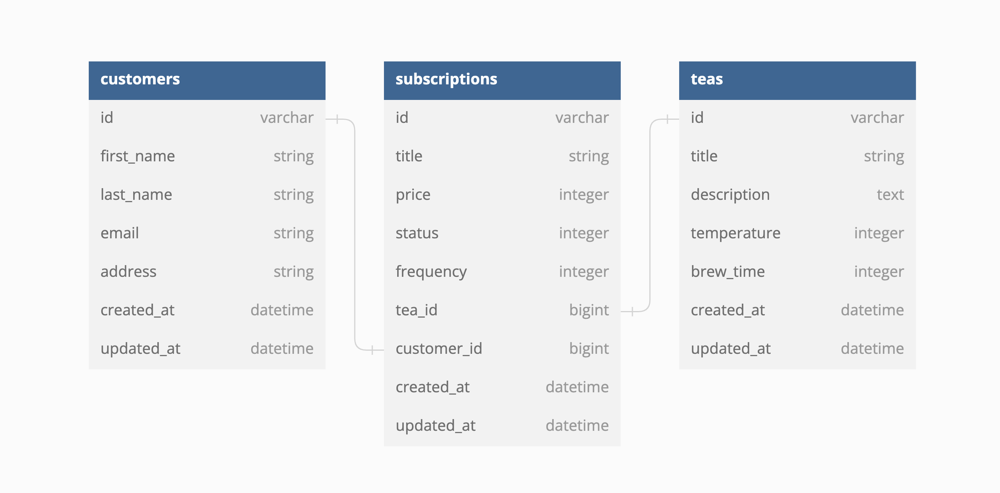

<div align="center">

## Tea Subscription

[![ruby][ruby]][ruby-url] [![ror][ror]][ror-url] [![Postgres][Postgres]][Postgres-url]

#### Contributors: [Anna Marie Sterling](https://github.com/AMSterling)

</div>

---

## Description

A rails backend API for Tea Subscription

---

# <a name="contents"></a> Table of contents

- [Architecture](#architecture)
- [Database setup](#database-setup)
  - [Required API keys](#required-keys)
- [Endpoints](#endpoints)
  - [Create Subscription](#create-sub)
  - [Cancel Subscription](#cancel-sub)
  - [Fetch Customer Subscriptions](#customer-subs)

---

# <a name="architecture"></a>Architecture

[Back to top](#contents)

# 

Tea Subscription was built with test-driven development, with Rspec used for testing. It is built with Rails conventions over configuration as a guiding principle. A service-facade design pattern is used when calling external API services.

---

# <a name="database-setup"></a>Database Setup

Instructions to set up a local version of Tea Subscription:

Fork and clone the project, then install the required gems with `bundle`. A full list of gems that will be installed can be found in the [gemfile](gemfile).

```sh
bundle install
```

Reset the database:

```sh
rake db:{drop,create,migrate}
```

## <a name="required-keys"></a> Required keys

Tea Subscription uses <a href="https://spoonacular.com/food-api" target="_blank" rel="noopener noreferrer">Spoonacular API</a>

Once you have your key, set up your environment with

```sh
bundle exec figaro install
```

 Then add your keys to `config/application.yml`:

```ruby
spoonacular_api_key: <YOUR_SPOONACULAR_KEY>
```

Start a rails server, and you're ready to query

```sh
rails s
```

---

# <a name="endpoints"></a>Endpoints

## <a name="create-sub"></a>Create Subscription

[Back to top](#contents)

Creates a new customer subscription.

<br>

```
POST '/api/v1/subscriptions'
```

**Sample response (status 200)**

 ```
{
  "data": {
      "id" => 565,
      "title" => "Bridgette Konopelski's Black",
      "price" => 15,
      "status" => "active",
      "frequency" => "monthly",
      "tea_id" => 575,
      "customer_id" => 583,
      "created_at" => Thu, 05 Jan 2023 17:30:42 UTC +00:00,
      "updated_at" => Thu, 05 Jan 2023 17:30:42 UTC +00:00
  }
}
 ```

---

## <a name="cancel-sub"></a>Cancel Subscription

[Back to top](#contents)

Cancel a customer subscription.

<br>

```
PATCH '/api/v1/subscriptions'
```

<br>

**Sample response (status 200)**

 ```
{
    "data": {
      "id" => 579,
      "title" => "Paula Cole's White",
      "price" => 14,
      "status" => "cancelled",
      "frequency" => "quarterly",
      "tea_id" => 589,
      "customer_id" => 590,
      "created_at" => Thu, 05 Jan 2023 17:33:42 UTC +00:00,
      "updated_at" => Thu, 05 Jan 2023 17:33:42 UTC +00:00
    }
}
 ```

---

## <a name="customer-subs"></a>Customer Subscriptions

[Back to top](#contents)

Fetch all subscriptions belonging to a customer.

<br>

```
GET "/api/v1/customers/#{customer_id}/subscriptions"
```

**Sample response (status 200)**

 ```
 {
   :data=>
  [{:id=>"594",
    :type=>"subscription",
    :attributes=>
     {:title=>"Jan Muller's Black", :status=>"active", :price=>10, :frequency=>"one_time", :tea_id=>604, :customer_id=>598}},
   {:id=>"595",
    :type=>"subscription",
    :attributes=>
     {:title=>"Jan Muller's White", :status=>"active", :price=>11, :frequency=>"quarterly", :tea_id=>605, :customer_id=>598}},
   {:id=>"596",
    :type=>"subscription",
    :attributes=>
     {:title=>"Jan Muller's Herbal", :status=>"active", :price=>12, :frequency=>"quarterly", :tea_id=>606, :customer_id=>598}}]
}
 ```

---

<!-- BADGE LINKS -->

[ruby]: https://img.shields.io/badge/Ruby-CC342D?style=for-the-badge&logo=ruby&logoColor=white
[ruby-url]: https://www.ruby-lang.org/en/

[ror]: https://img.shields.io/badge/Ruby_on_Rails-CC0000?style=for-the-badge&logo=ruby-on-rails&logoColor=white
[ror-url]: https://rubyonrails.org/

[Postgres]: https://img.shields.io/badge/postgres-%23316192.svg?style=for-the-badge&logo=postgresql&logoColor=white
[Postgres-url]: https://www.postgresql.org/
